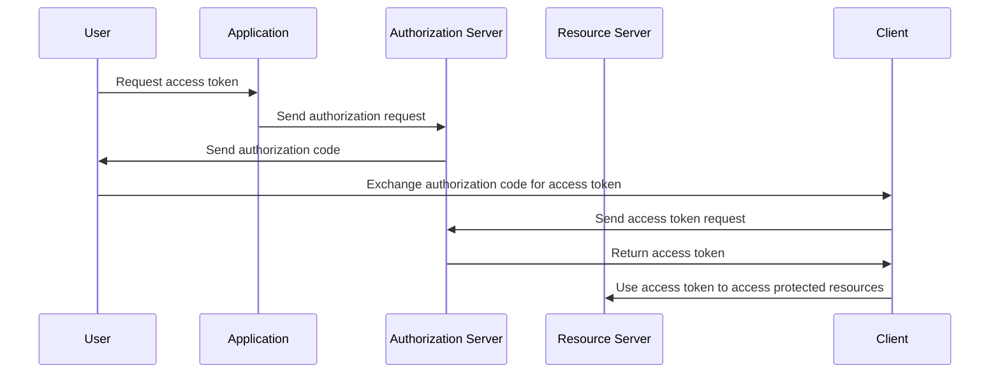
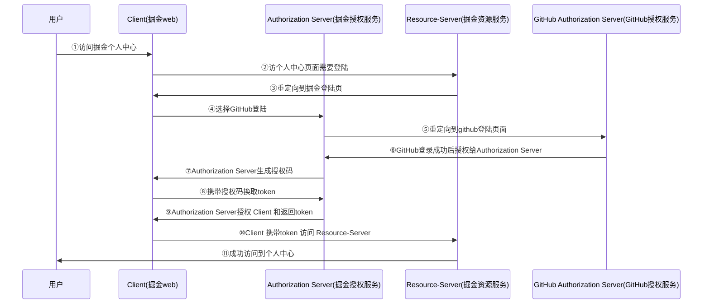

**OAuth 2.0 授权码流程图**

```mermaid
sequenceDiagram 
    participant U as User
    participant A as Application
    participant S as Authorization Server
    participant R as Resource Server
    participant C as Client

    U->>A: Request access token
    A->>S: Send authorization request
    S->>U: Send authorization code
    U->>C: Exchange authorization code for access token
    C->>S: Send access token request
    S->>C: Return access token
    C->>R: Use access token to access protected resources
```

**Spring Authorization Server 和spring Security 中OAuth 2.0 流程图**

```mermaid
sequenceDiagram
    participant U as 用户
    participant C as Client(掘金web)
    participant CA as Authorization Server(掘金授权服务)
    participant R as Resource-Server(掘金资源服务)
    participant A as GitHub Authorization Server(GitHub授权服务)

 U->>C: ①访问掘金个人中心
 C->>R: ②访个人中心页面需要登陆
 R->>C: ③重定向到掘金登陆页
 C->>CA: ④选择GitHub登陆
 CA->>A: ⑤重定向到github登陆页面
 A->>CA: ⑥GitHub登录成功后授权给Authorization Server
 CA->>C: ⑦Authorization Server生成授权码
 C->>CA: ⑧携带授权码换取token
 CA->>C: ⑨Authorization Server授权 Client 和返回token
 C->>R: ⑩Client 携带token 访问 Resource-Server
 R->>U: ⑪成功访问到个人中心
```

